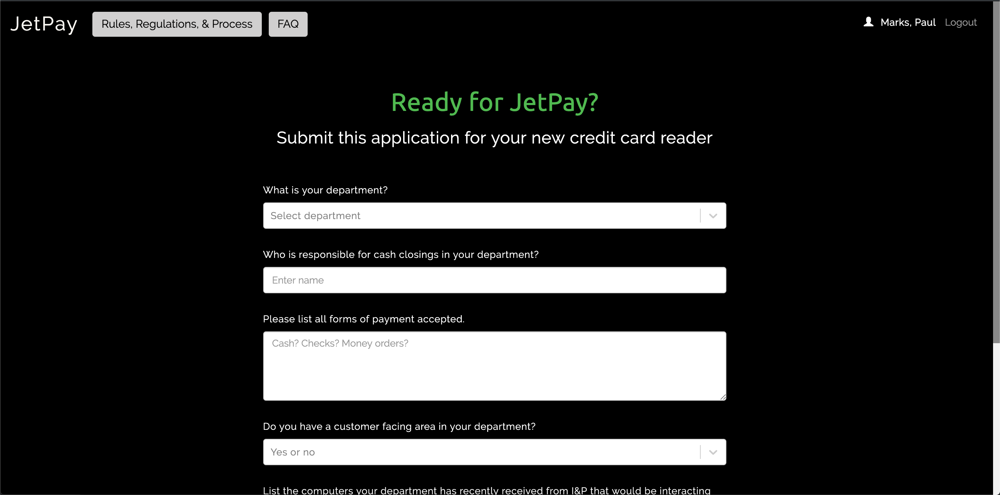

# Jetpay Intake

Jetpay Intake is used by the Department of Finance at the City of Pittsburgh to handle new requests for credit card readers used throughout City services.

New requests are forwarded via [Sendgrid](https://github.com/CityofPittsburgh/sendgrid-proxy) directly to [JetPay](https://www.jetpay.com/), the payment service provider used by the City.



## A note on boilerplate

The bones of Jetpay Intake are shared across all client applications developed by Paul Marks for the City of Pittsburgh.  For more in-depth documentation on the structure,  design choices, authentication flow, and installation procedures for this application, please see the documentation for the [boilerplate](https://github.com/CityofPittsburgh/react-typescript-boilerplate).

This README will focus only on the components of this application that are unique to Jetpay Intake.

## Structure
    ...
    app
    ├── src                         
        ├── components        
            |── faq         # Frequently asked questions of Jetpay
            |── form        # Intake form and post functions
            |── policy      # City policy for credit card readers

## Running Locally

### Prerequisites

* [Node.js](https://nodejs.org) - JS runtime
* .env - See .env.example for all required secrets

### Installation
```
git clone https://github.com/CityofPittsburgh/jetpay-intake
cd jetpay-intake
// first, install dependencies for the server
npm install
// then, install dependencies for the client
cd app
npm install
// to run the app locally and bypass auth
npm start
// to bundle the app for deployment
npm run build
// to run the app from the minified build, with auth workflow
cd ..
node server.js
```

## Deployment

Both staging and production services are hosted in Azure.  Application is deployed directly from github, and can be triggered either (a) through the Azure GUI, (b) through the [CLI](https://docs.microsoft.com/en-us/cli/azure/webapp/deployment/source?view=azure-cli-latest#az-webapp-deployment-source-sync), or (c) through the [proxy service](https://github.com/CityofPittsburgh/azure-proxy).

For complete documentation on the azure environment, see [here](https://github.com/CityofPittsburgh/all-things-azure.git).

## License

This project is licensed under the MIT License - see the [LICENSE.md](LICENSE.md) file for details